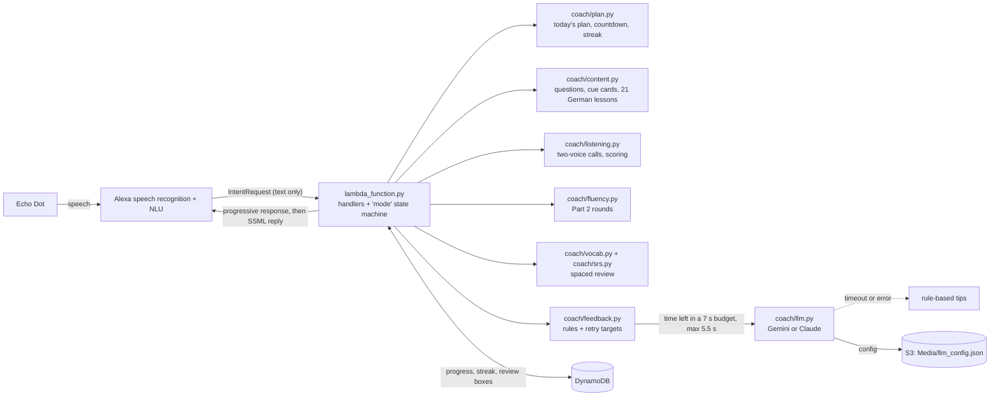

# IELTS & German Coach: an Alexa study coach

[](https://github.com/Golden007-prog/Alexa_LLM/actions/workflows/ci.yml)

A private Alexa skill for an Echo Dot. It runs IELTS Speaking mock tests with examiner-style feedback, IELTS Listening Part 1 drills in British, Australian and American voices, a vocabulary upgrade drill, and beginner German taught by a native German voice. Each day's practice is planned around your exam date. The design rests on learning research: retrieval practice, spaced review, repeated talks to build fluency, and focused feedback followed by a retry. See [docs/LEARNING_DESIGN.md](docs/LEARNING_DESIGN.md).

The skill runs as an Alexa-hosted skill (Python 3.8, AWS Lambda) and stays in the development stage, so it is free and works only on devices registered to your Amazon account.

## What you can say

Start with **"Alexa, open study coach"**. You can also ask in one go: "Alexa, ask study coach for a German lesson".

| Say | What happens |
|---|---|
| *(open)*, "today's plan" | A plan picked from the days left before your exam, for example "a Part 2 round, a listening call and three minutes of German". Say "yes" to start, then "next" between activities. |
| "my exam is on October 28th" | Sets or changes the exam date used for the countdown, the plan and review timing. |
| "mock test" | A full Speaking test: Part 1 (two topics, six questions), Part 2 (cue card, timed one-minute prep, a talk of up to two minutes) and Part 3 (three discussion questions), then feedback. |
| "part one" / "part two" / "part three" | Practise one part on its own. |
| "fluency rounds" | Tell the same Part 2 story three times, in 2:00, 1:30 and 1:00, and hear your rough pace for each round. |
| "feedback" | Review everything since the last feedback, at most two fixes, then answer one question again using a target phrase. |
| "listening drill" / "listening drill australian" | A two-voice phone call (14 scenarios), then five questions: spelling, phone number, date, number and A/B/C. "Repeat" replays the call. |
| "vocabulary drill" | Upgrade a plain sentence ("The weather was very good") with a stronger word, then hear a band-7 model. |
| "German lesson" / "German lesson 7" | Five phrases spoken slowly, then at normal speed, a pronunciation tip, and a meaning quiz. |
| "German review" | The phrases you're closest to forgetting. Once a phrase is well known, you say it in German and judge yourself against the model. |
| "how am I doing" | Countdown, streak, mock tests, best Part 2 pace, focus phrase, weakest listening item, German lesson and phrases due. |
| "repeat" · "next" / "skip" · "help" · "menu" · "stop" | Work everywhere. |

## Architecture



Every request is a pure function of the request, the session attributes (current `mode`, queue and plan) and the saved progress. That is what makes the whole skill testable offline: [tests/test_flows.py](tests/test_flows.py) feeds real Alexa request envelopes through `lambda_handler`.

## Design decisions

- **A catch-all slot captures free speech.** `AnswerIntent` has the single sample `{answer}`, using a custom slot type, with fallback sensitivity set to LOW. Spoken commands inside answers ("next", "I'm finished", "feedback") are routed in code. Amazon recommends `AMAZON.SearchQuery` for free-form input, but it needs a carrier phrase ("my answer is …") in every sample. That breaks natural answers, so the skill keeps the catch-all and has SearchQuery as the fallback if device tests show problems.
- **Part 2 arrives in chunks.** Alexa stops listening when you pause, so a two-minute talk comes in several requests. Each chunk gets a short, fixed "go on", with no network call. The talk ends at "I'm finished", the time limit (from request timestamps) or a word cap.
- **Every reply fits Alexa's ~8 second window.**
  - The progressive response ("Let me review your answers") is capped at 1.5 s, and the S3 and DynamoDB clients at 1 s with no retries.
  - The LLM gets whatever is left of a 7-second budget, and never more than 5.5 s.
  - A test stalls every dependency at once and checks that the reply still arrives in time, with rule-based tips.
- **Python 3.8 is the runtime.** Alexa-hosted skills still get Python 3.8, and AWS blocks updates to it from March 2027. CI tests 3.8 and 3.12, and `vermin` enforces 3.8 syntax. The skill logs `sys.version` at cold start.
- **Review uses Leitner boxes, not FSRS.** FSRS's gains come from tuning on large review histories. About 150 items over four weeks don't need it (see the design doc, §4.2).
- **Retry targets are deterministic.** The LLM writes the feedback, but the "use *although* this time" target comes from rules. Checking the retry never depends on parsing model output.
- **One interaction model serves all locales.** `en-IN` is edited, and `scripts/sync_locales.py` copies it to `en-US` and `en-GB`. A test fails if they drift.

## Honest limits

- **No pronunciation scoring, anywhere.** A skill receives Alexa's transcript, never audio. Fillers ("umm") are mostly removed, so fluency looks better than it is. Record yourself on your phone as well.
- **German speaking is self-graded.** The skill runs in an English locale, so it checks what German phrases *mean*. When you say German, it plays the model and you judge.
- **Band estimates and pace are rough.** The AI's band ranges are an estimate from a transcript. Words-per-minute includes Alexa's own replies between chunks. Compare rounds, not absolute numbers.
- **Routines can only open the skill.** That is why opening it starts today's plan. Passing "ask study coach for…" through a Routine's custom action is unverified.

## Install on your Echo Dot

You need the same Amazon account your Echo uses (amazon.in) to sign in to the [Alexa Developer Console](https://developer.amazon.com/alexa/console/ask). There are two ways; the step-by-step clicks are in [docs/DEPLOY.md](docs/DEPLOY.md).

- **Path A, console Git import (one time, simplest).** Create Skill → "IELTS and German Coach", English (IN), Custom, Alexa-hosted (Python) → Import skill → `https://github.com/Golden007-prog/Alexa_LLM.git` → Build → Test tab: Development.
- **Path B, ASK CLI (for ongoing updates).** `ask init --hosted-skill-id <id>` into a separate folder, then run [scripts/deploy-hosted.ps1](scripts/deploy-hosted.ps1), which copies `lambda/` and `skill-package/` across and runs `git push origin master`.

Optional AI examiner feedback, with band ranges and quoted fixes, needs a Gemini or Claude key. It is stored in the skill's own S3 bucket or Code tab, never in GitHub; see [docs/DEPLOY.md](docs/DEPLOY.md#ai-feedback-key).

## Test locally

```
uv venv --python 3.12 .venv            # or: python -m venv .venv
uv pip install -r requirements-dev.txt
python -m pytest                       # or: python tests/test_flows.py
vermin "-t=3.8-" --no-tips --violations lambda
```

The 67 tests feed real request envelopes through the handler. They check:
- every response stays under Alexa's limits: SSML of 8,000 characters or fewer, well-formed XML, breaks of 10 s or less, and estimated audio within 240 s (90 s for reprompts);
- no voice name is ever spoken;
- the interaction models match the handlers;
- every flow behaves as above, including the network-stall tests.

CI runs them on Python 3.8 and 3.12 for every push and pull request, along with vermin and a scan for committed keys.

## Demo (simulated)

Stitched together from several sessions in the offline harness and lightly trimmed (marked "..."). Feedback is rule-based because no API key was set:

```
You:    Alexa, open study coach.
Alexa:  Welcome back. 24 days to your exam. Today: a full mock test and a German
        lesson. About 21 minutes. Say yes to start, or ask for something else ...
You:    Fluency rounds.
Alexa:  Fluency rounds. You'll tell the same story three times: in two minutes,
        ninety seconds, then one minute ... Describe a time you had to make an
        important decision ... Your minute starts now.
        ... (one-minute prep, then the talk in chunks) ...
Alexa:  Thank you. Round two: tell me the same story again, with the same details,
        in ninety seconds. Go.
You:    Feedback.
Alexa:  Your answers averaged 9 words. Aim for two or three sentences each: answer,
        reason, then an example. You said very 12 times. Try extremely, remarkably,
        or incredibly. Let's lock one in. Answer this again, and this time use a
        stronger word than very, like extremely. Is it easy to make new friends
        as an adult?
You:    It is extremely good, although busy.
Alexa:  Nice, you used a stronger word than very. That's the kind of language
        examiners reward.
You:    German review.
Alexa:  German review: 2 phrases, the ones you're closest to forgetting ... I can't
        hear German pronunciation, so you'll be the judge. Number one. Say this in
        German: I come from India.
You:    (says it)
Alexa:  Here it is: Ich komme aus Indien. Ich komme aus Indien. Did yours match?
```

A step-by-step script for testing on the device is in [docs/DEVICE_TEST_SCRIPT.md](docs/DEVICE_TEST_SCRIPT.md).

## Project layout

```
lambda/                      Alexa-hosted Lambda code (Python 3.8)
  lambda_function.py         handlers, state machine, today's plan, skill builder
  coach/                     content, plan, srs, vocab, fluency, listening, feedback, llm, speech, numbers
  requirements.txt           ask-sdk-core, ask-sdk-dynamodb-persistence-adapter
  config.example.json        LLM config template (real config.json is gitignored)
skill-package/               skill.json + interaction models (en-IN, en-US, en-GB)
tests/test_flows.py          offline end-to-end tests
scripts/                     sync_locales.py, deploy-hosted.ps1, dialog replay template
docs/                        learning design, deploy guide, device test script, Alexa+ options
```

## Roadmap (proposed, not built)

1. **LLM follow-up questions in Part 1.** After an answer, ask the model for one natural follow-up, like an examiner would. It must return within 2.5 s, run after a short fixed acknowledgement, and fall back to the next static question. Answers would be capped and SSML-escaped like feedback.
2. **Per-answer quick tips outside the mock test.** A "coach mode" where each Part 1 or Part 3 answer gets one rule-based tip at once, reusing the deterministic retry targets, with no LLM, so it stays instant.
3. **A Hindi or English bridge to German.** For phrases you already know in Hindi or English, link them to the German ("Shukriya, thank you, Danke"). Alexa+ now speaks Hindi in India. Whether a classic en-IN skill can voice Hindi through SSML is unverified, so this needs a device test before building. Romanised Hindi read by an English voice is the fallback.

Whether to also expose the coach to Alexa+ as an add-on is answered in [docs/ALEXA_PLUS_OPTIONS.md](docs/ALEXA_PLUS_OPTIONS.md). The short answer is not yet.

## License

Apache-2.0, see [LICENSE](LICENSE). All questions, cue cards, dialogues and vocabulary items are original and written in the public IELTS format. None are copied from Cambridge books or official sample tests.
